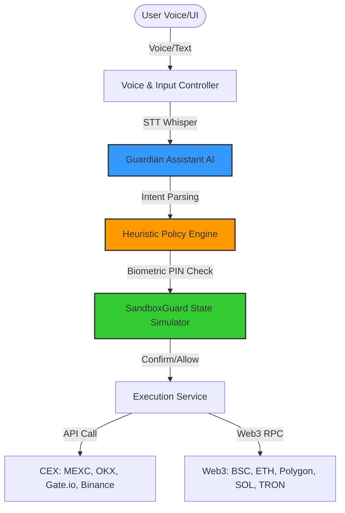

# 🛡️ IBITI Guardian

<p align="center">
  
</p>

<p align="center"><b>AI-Powered Voice Assistant & Secure Transaction Guard for Web3 & CEX</b></p>

<p align="center">
  <a href="https://github.com/VOVAN1980/ibiti-guardian">
    
  </a>
  <a href="https://vovan1980.github.io/IBITILabs">
    
  </a>
</p>

<p align="center">
  
  
  
  
</p>

---

**IBITI Guardian** is a secure, non-custodial crypto wallet and CEX controller equipped with a real-time, voice-controlled AI Agent (Jarvis / Guardian AI). 

Designed to combine hands-free voice execution with bank-grade security, Guardian protects Web3 and CEX users through biometric verification, sandbox transaction execution, and strict heuristic policies. It allows users to trade, swap, and transfer crypto purely via voice commands under the safety of a local security shield.

---

## 🎙️ Core Pillars

### 1. Guardian Voice AI (Jarvis)
Hands-free trade execution and market intelligence powered by a customized speech processing pipeline:
- **Speech-to-Text (STT)**: Powered by Whisper, translating raw vocal intents into structured crypto trade orders.
- **Text-to-Speech (TTS)**: Built with OpenAI's model family (GPT-4o / GPT-4o-mini-tts / TTS-1) and optimized using custom pronunciation guidelines for precise crypto speech (e.g., *«Ибити»*, *«Ю-эс-ди-ти»*, *«ор-дер»*).
- **Conversational Feedback**: Concise voice confirmations (e.g., *«Ордер исполнен, удачных торгов.»*) designed to keep speech short, clean, and professional.

### 2. AI Autonomy & Control Modes
Define how much execution authority the AI has:
- **Manual**: Direct manual control. The AI is fully blocked from executing any trade or transaction.
- **Guarded**: Standard operating mode. The AI analyzes market data and requests your explicit authorization (via biometrics/PIN) before signing any transaction.
- **Full Autonomy**: Automatic AI execution. The AI carries out market actions independently, strictly bounded by your configured budgets and policy constraints.

### 3. Heuristic Policy Engine & SandboxGuard
A double-layered shield validating every transaction *before* it leaves your device:
- **SandboxGuard**: Automatically runs a local pre-flight RPC simulation of Web3 transactions to verify execution paths and inspect state changes.
- **Dynamic Policy Checks**: Restricts execution based on daily trade limits, transaction sizes, slippage caps, and price impact (blocking swaps with >5% impact, warning on 1-5%).
- **Reputation Check**: Blocks untrusted contracts and automatically adjusts risk warnings for verified, trusted entities.

### 4. Eternal Permission Kernel (EPK)
A local, secure vault module managing sensitive credentials:
- Uses hardware-backed secure storage and local biometrics (PIN, FaceID, Fingerprint) to unlock the app.
- Keeps private keys, API secrets, and security configuration local and encrypted.

### 5. Multi-Chain Web3 & Centralized Exchange (CEX) Hub
Unified management across DeFi and CeFi:
- **Supported CEXs**: Direct, encrypted API integration for spot trading on **MEXC**, **OKX**, **Gate.io**, and **Binance**.
- **Supported Web3 Networks**: Multi-chain support for **BSC, Ethereum, Polygon, Arbitrum, Optimism, Base, Solana, and Tron**.
- **Embedded Web3 Wallets**: Seamless social login (Google/Apple) and embedded non-custodial wallet creation powered by Privy.

---

## 🏗 System Architecture



---

## 🛠 Technology Stack

| Component | Technology |
|-----------|------------|
| **Core Framework** | Flutter (Dart SDK >= 3.3.4) |
| **Authentication & Web3** | Privy Flutter SDK (`privy_flutter`) |
| **Database & Cache** | SQLite (`sqflite`) & SharedPreferences |
| **Vault Encryption** | Flutter Secure Storage (`flutter_secure_storage`) |
| **AI Models** | OpenAI GPT-4o / GPT-4o-mini-tts |
| **Voice Processing** | Record (Audio Recording) & Audioplayers (Audio Output) |
| **Local Security** | Local Auth (`local_auth`) for biometrics |

---

## ⚙️ Getting Started

### Requirements
- Flutter SDK (`>= 3.3.4`)
- Android SDK (API Level 28+) / iOS 14+
- OpenAI API Key (Required for voice capabilities)
- Moralis API Key (Required for portfolio balance scan)

### Installation

1. **Clone the Repository**:
   ```bash
   git clone https://github.com/VOVAN1980/ibiti-guardian.git
   cd ibiti-guardian
   flutter pub get
   ```

2. **Setup Credentials**:
   Create a `secrets/` directory inside your root folder and add the following configuration files:
   
   - **`secrets/openai.json`** (OpenAI API credentials):
     ```json
     {
       "apiKey": "YOUR_OPENAI_API_KEY"
     }
     ```
     
   - **`secrets/moralis.json`** (Moralis API for balance querying):
     ```json
     {
       "MORALIS_API_KEY": "YOUR_MORALIS_KEY",
       "CHAIN": "bsc"
     }
     ```
     
   - **`secrets/privy.json`** (Privy SDK credentials):
     ```json
     {
       "PRIVY_APP_ID": "YOUR_PRIVY_APP_ID",
       "PRIVY_CLIENT_ID_ANDROID": "YOUR_ANDROID_CLIENT_ID",
       "PRIVY_CLIENT_ID_IOS": "YOUR_IOS_CLIENT_ID"
     }
     ```

3. **Run the Application**:
   ```bash
   flutter run --release
   ```

---

## 🛡️ License

This project is licensed under the MIT License. See the [LICENSE](LICENSE) file for details.
