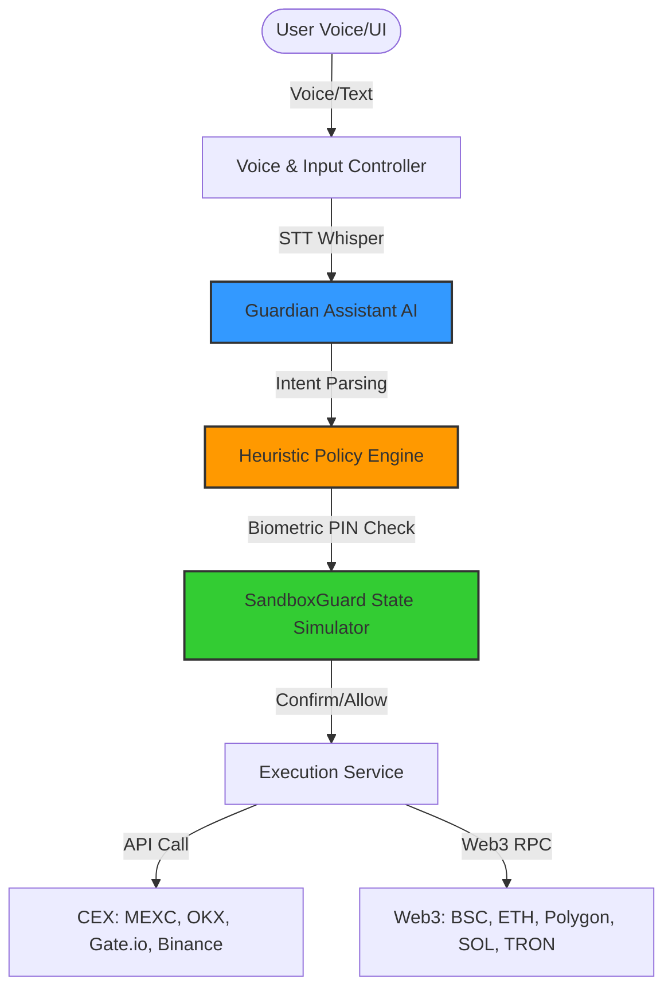

# System Architecture

This document details the modular technical architecture of **IBITI Guardian**. The system is built around a secure event and controller pipeline designed to isolate user secrets, verify intent, and simulate state changes before signing transactions.

---

## 🏗 High-Level System Layout

---

## 📦 Core Component Modules

### 1. Voice & Intent Resolution Pipeline
* **VoiceTurnController**: Manages speech recording sessions and coordinates flow between audio devices, Speech-To-Text, and the LLM engine.
* **SttService (Whisper)**: Transcribes the raw vocal audio input locally or via transient HTTPS calls to Whisper models.
* **GuardianAssistantService (Jarvis)**: Decodes the natural language transcription into a structured JSON trade payload (e.g., action, amount, symbol, target platform).
* **TtsService (OpenAI / GPT-4o-mini-tts)**: Synthesizes responses using pronunciation-optimized prompts to prevent syllable skipping, foreign accents, or spelling out long IDs.

### 2. Guard & Security Layer
* **Heuristic Policy Engine**: Inspects the trade payload against safety constraints (daily budgets, per-transaction limits, allowed assets, and platform statuses).
* **SandboxGuard**: For Web3 operations, queries public RPC nodes to perform pre-flight transaction simulations. It analyzes target bytecode, checks for proxy patterns, and parses potential state changes.
* **Eternal Permission Kernel (EPK)**: On-chain permission & policy enforcement for Smart Accounts (per-tx / daily spend limits, target-selector guards, threat-feed blocklists). It governs *what the AI may execute* — it does not store keys. Live on BSC Testnet; enforced locally today.
* **Local Secure Storage**: Hardware-backed secure storage (`flutter_secure_storage`) plus biometrics (PIN / FaceID / Fingerprint) for app unlock; stores wallet metadata and encrypted config. Embedded wallet keys are managed by Privy's non-custodial infrastructure.

### 3. Execution Engines
* **ExchangeOrderService**: Handles credentials, signature signing, and request formatting to execute spot market orders on centralized exchanges (MEXC, OKX, Gate.io, Binance).
* **Web3 Swap & Send Service**: Orchestrates Web3 transactions (swaps via 0x/Jupiter and native/ERC20 transfers) and pipes them into the signing/verification queue.
* **Transaction Queue**: Coordinates retry logic, handles nonce management, and logs transaction audits to prevent double-spending or silent failures.

---

## 🔄 Sequence: Voice Command to Order Execution

1. **Vocal Input**: User says *«Купи SOL на 5 долларов через MEXC»* (Buy SOL for 5 dollars on MEXC).
2. **Transcription**: Whisper converts the audio stream to text.
3. **Intent Parsing**: Jarvis AI interprets this as a `BUY` order of `SOL` worth `5 USD` on `MEXC`.
4. **Policy Check**: The Policy Engine verifies:
   * Is `MEXC` an allowed exchange source? (Yes)
   * Is the order size ($5) above the minimum limit ($5)? (Yes)
   * Does it fit within the user's daily remaining budget? (Yes)
5. **Execution Mode Check**:
   * *If Guarded*: Pops up a confirmation modal requesting FaceID/PIN.
   * *If Full Autonomy*: Proceeds automatically.
6. **Execution**: The Exchange Order Service signs the request with the locally decrypted API key and sends it to MEXC.
7. **Clean Feedback**: Voice assistant receives the confirmation and speaks: *«Ордер успешно выполнен, удачных торгов.»*
